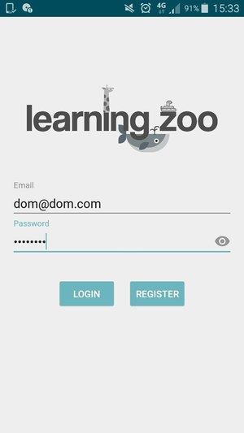
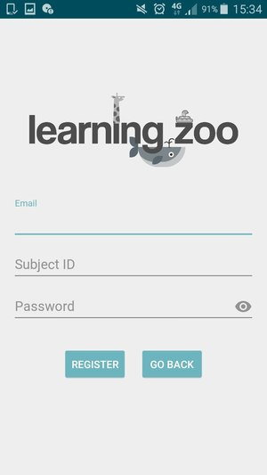
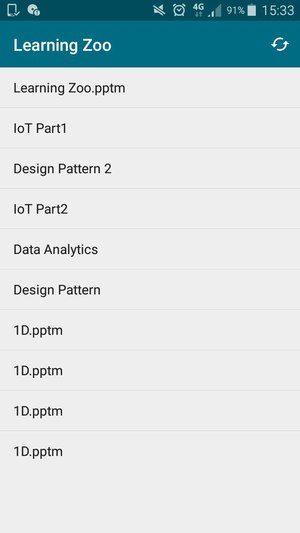
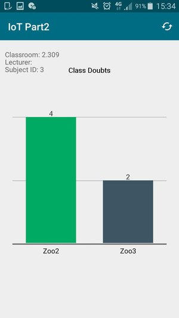

# Learning Zoo Android Application

Instructor need to login with their credentials for using the app

Instructor can register with us. Only emails from our database (that we already
authenticate as actual professors' emails) can be used to register.

This the home page with the history of all the classes that was hosted by the
instructor. Clicking on the item will bring the user to data analysis of the class.

This is the analysis of the class using graph to display the number of students
who did not understand for each topic.
