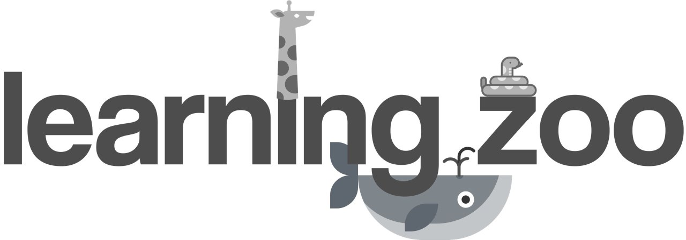

# LEARNING ZOO



An in-class understanding tracking system

## 1. Problem we're trying to tackle:
- Students are sometimes too shy to voice their uncertainties over concepts that are taught in lecture
- Students ask questions that majority of the class already captured, which wastes the class and lecturer's time
- Lecturers have no way to get analytics on whether their lessons are interesting, well-paced, easy to understand

## 2. Overview of the system:

### How it works
LearningZoo is designed for students to discreetly give feedback to the lecturer
during lessons. Students may not be able to understand the topic that the lecturer
is teaching in class and this attempts to tackle that problem. Often, even when
a student has doubts about the lesson material, the student does not raise a
question regarding the material as it may seem obvious to others and would be a
waste of precious lesson time. The lecturer is not able to obtain proper feedback
regarding the material taught. Students who get lost in lectures would then not
be able to follow in the subsequent lessons as well. LearningZoo implements a
feedback button on the armrest of every seat in the classroom. This enables
students to signal if they are unsure of the content currently shown on the
powerpoint slide. The online server hosted on Heroku collects all the button
presses by students and an LED in class lights up when more than 50% of the
students are unsure. After class, lecturers can login to the mobile app to view
their lesson information and review the topics that have had the most button
presses from students. This system enables lecturers to obtain more feedback on
their lessons and improve their lessons appropriately. It also benefits students
as they can actively show their learning progress.

### Cloud Server
Our server acts as a centralised control system where other components in the
system (desktop plugin, in-class system, mobile application, and database)
communicate with to work as a whole.
Reference: [API documentation](./LearningZooServer/README.md)

### Desktop plugin
This is a plugin for Microsoft PowerPoint so the instructors can register the
material under his name and course, assigning topics to relevant slides.
Reference: [Instruction Manual](./DesktopPlugin/InstructionManual.pdf)

### In-class hardware system
We mount micro-controllers with buttons on class chairs to allow student to express
their not-understanding by pressing the button

### Data Analytics Application
Instructors can use the app to access the history of all classes that they taught
and view the students' responses (e.g. how many people did not understand which
topic).
Reference: [Detailed documentation](./LearningZooAndroid/README.md)

## 3. Technical Analysis of the System
### Cloud Server
### Desktop plugin
### In-class hardware system
### Data Analytics Application

## 4. Cloud Server

### Tech Stack
- [Ruby on Rails](http://rubyonrails.org/)
- [Postgresql](https://www.postgresql.org/)
- [Heroku](https://www.heroku.com/)

### How to start
The server is up and running at [http://learning-zoo.herokuapp.com/](http://learning-zoo.herokuapp.com/)
The API documentation can be found [here](./learning-zoo-server/README.md). You
can try out the API using tools like [Postman](https://www.getpostman.com/)

## 5. Desktop Plugin

### Tech Stack
- [Microsoft Visual Basic for Application](https://en.wikipedia.org/wiki/Visual_Basic_for_Applications)

### How to start
The instruction manual can be found [here](./DesktopPlugin/InstructionManual.pdf)

## 6. In-class hardware system

### Tech Stack
- [Raspberry Pi](https://www.raspberrypi.org/)

### How to start
Transferring the [raspberry code](./RaspberryCode/1dpi.py) to your raspberry pi,
ssh into your raspberry pi, and start the code from your terminal
```bash
scp ./RaspberryCode/1dpi.py pi@<your-raspberrypi-ip-address>:~/
ssh pi@<your-raspberrypi-ip-address>
# after you successfully login into your pi
python ~/1dpi.py
```
Connect the button to Raspberry Pi on GPIO pin 13 and 3.3V. Pressing this button
will send a post request to server if there is a currently running class.

## 7. Data Analytics Application

### Tech Stack
- [Java](https://java.com/en/)
- [Android](https://www.android.com/)

### How to start
Load the ./LearningZooAndroid project into your Android SDK and compile it to
your phone.
Sample credentials to login to the app:

Account 1: ```dom@dom.com```
Password: ```12345678```

Acount 2:```kevin@kevin.com``` Password: ```12345678```


## 8. Future Improvement of the System

## 9. Contribution

### Getting started

Clone the repositories

```bash
git clone git@github.com:stanleynguyen/learning-zoo.git
```

Create a new branch with understandable name and create an upstream tracking branch on GitHub

```bash
git checkout -b <explanatory-branch-name>
git push --set-upstream origin <your-branch-name>
```

and start coding. When you are almost done, go to GitHub and [create a Pull Request](https://help.github.com/articles/creating-a-pull-request/) so everyone can review the code and discuss then merge.

Happy coding!!

### Useful Links

* [User Story](docs/userstory.md)
* [Sprint Planning](docs/sprintplanning.md)
* [Android Style Guide](https://github.com/ribot/android-guidelines)

## 10. Acknowledgement

*SUTD 50.001 Instructors:*
- Prof. Ngai-Man Cheung
- Prof. Jit Biswas
- Prof. Andrew Yoong
- Prof. Ng Geok See
